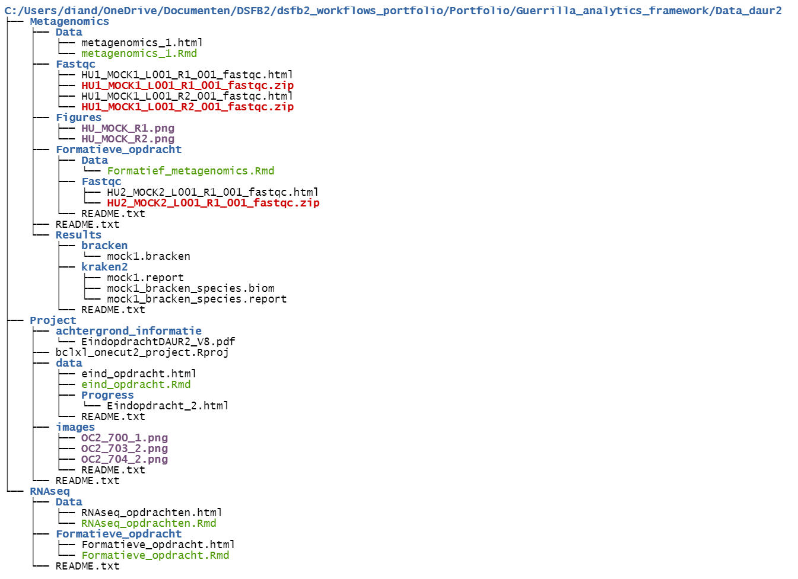

# Guerrilla analytics structure
The folder tree below shows my folder structure of the DAUR2 lessons. These lessons were are a part of the data science for biology 1 course at Hogeschool Utrecht. 

{ width=70%}

