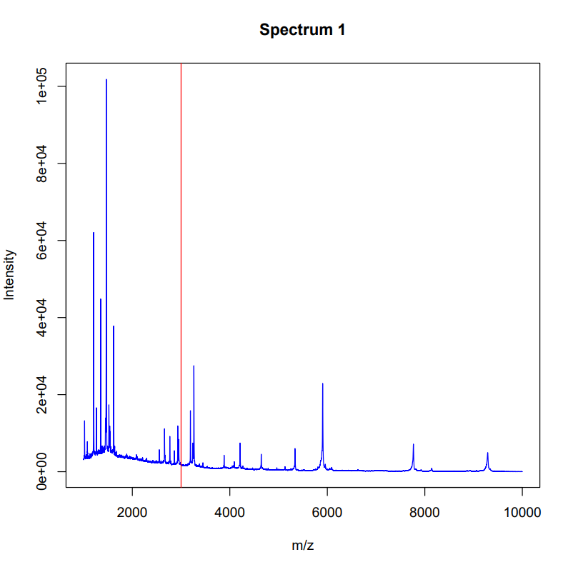
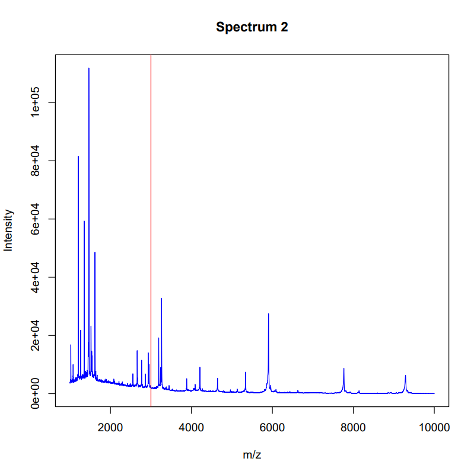

# Analyzing mass spectrometry data in R <br>
## Introduction 
Since my last study I have become very interested in microbiology. This has led me to choose to follow my specialization in microbiology at my current study Life Sciences. This has made me even more enthusiastic about the profession. In 2 years time I see myself working in diagnostics at a medical microbiology laboratory. To achieve this goal, I will complete my graduation internship in a similar direction as well. <br>

In microbiology, MALDI-TOF MS is currently a widely used method to quickly identify a bacterial species. For this reason, I thought it would be interesting to process raw data from a mass spectrometry experiment in R and visualize the results.
MALDI-TOF MS, or Matrix Assisted Laser Desorption/Ionization Time of Flight Mass Spectrometry, separates ions by their mass to charge ratio and determines that mass to charge ratio by the time it takes for the ions to reach a detector. <br>

## Planning 
The first thing I'm going to do is delve into the analysis of mass spectrometry data in R. Have packages already been made for the analysis of MALDI-TOF MS data or mass spectrometry data in general? <br>
To achieve my goal I will take the following steps: <br>
- Finding articles about the subject of mass spectrometry <br>
- Finding mass spectrometry data (preferably from a MALDI-TOF experiment) <br>
- Finding out the structure of mass spectrometry data files <br>
- Writing code to visualize mass spectrometry data <br>
- Writing code to visualize or highlight specific m/z values in a figure <br>

## Data import
To get started with the processing of raw mass spectrometry data I will first need to find some data to work with. There are several packages with mass spectrometry data available. I used the data from the `msdata` package. The `msdata` data package provides multiple raw data mass spectrometry files.
```{r msdata import, warning=FALSE, message=FALSE}
# Load library
library(msdata)

# Get files from msdata
fls <- proteomics(full.names = TRUE)

basename(fls)

# Path variable to the file of choice
## I chose the second file, but you can change it to any you like. It is also possible to do all files.
path <- fls[2]

# Check
path
```

Now that I have provided the file path, I will try to access the data with the `mzR` package. The `mzR` package aims at providing a common, low-level interface to several mass spectrometry data formats. With this  package I can check the number of spectra, which is important for a identification for instance. <br>
```{r mzr, warning=FALSE, message=FALSE}
# Load library
library(mzR)

# Get the MS file from the path variable 
msfile <- openMSfile(path, backend = NULL, verbose = FALSE)

# Check number of spectra
msfile
```

## Spectra
We can check the spectra of the file we just loaded into R with the spectra function of the `mzR` package. It is possible to see specific spectra of the file by providing the index of a spectrum, but it is also possible to just check all spectra. Because I am not looking for a specific spectra I will check the spectra of sample 1. I also demonstrated the usage of the spectra function if you would like to look at two specific spectra or all spectra. The output is a matrix which consists of two columns. One column for the mflz-values and the second column shows the intensity's for the mflz-files. If you load all spectra, in this case 565 spectra, it gives a lot of output. Under the guise of keeping this Rmarkdown tidy, I won't show the output of the code to load all spectra.
```{r spectra, warning=FALSE, message=FALSE}
# Read one spectra from the input file
spectra1 <- spectra(msfile, 1)
head(spectra1)
```

```{r spectra 2 and all, eval=FALSE}
# Read multiple specific spectra 
spectra2 <- spectra(msfile, 1:2)
head(spectra2)

# Read all spectra from the input file
## all_spectra <- spectra(msfile)
## head(all_spectra)
```

```{r spectra length, warning=FALSE, message=FALSE}
# Length of the spectra
length(spectra1)
```

### Visualisation spectra
To get a better overview of what exactly the spectra entail, I wanted to visualize the spectra. This can also be done with the `mzR` package. I used the peaks function to extract the peaks and visualize them in a plot. In this case spectrum 8 was used. <br>
```{r spectra visualisation, warning=FALSE, message=FALSE}
# Read a spectrum from the file
peak <- peaks(msfile, 8)
head(peak)

# Count of the spectra peaks
peaksCount(msfile, 8)

# Plot the peaks
plot(peak[,1], peak[,2], type = "h", lwd=1)
```

## Annotation for each spectrum
Now that I have verified the presence of the spectra in the data, we can look at the corresponding annotation. This annotation is necessary to distinguish the spectra of different samples. In the data file I used, the different samples are encoded with numbers. 
```{r annotation, warning=FALSE, message=FALSE}
# Check annotation only
hdr <- header(msfile)
head(hdr)

# Check annotation of specific spectra
hdr_sp <- header(msfile, 8)
head(hdr_sp)
```

After obtaining the annotation, I want to visualize the data I have up until this moment. This can be done with the `MSnbase` package and the `msdata` package. The readMSdata function of the `MSnbase` package takes as input the file path to one or multiple raw mass spectrometry files. It generates an MSnExp object. 
```{r MSnbase, warning=FALSE, message=FALSE}
# Load library
library(MSnbase)

# Merge annotation with spectra
mse <- readMSData(path, mode = "onDisk", verbose = FALSE)
mse

# Access individual spectra information
mse[[8]]
```

```{r check annotation, eval=FALSE}
# Check annotation and raw spectra data
## The output will not be shown to keep the page tidy. 
fData(mse)
```

## Visualization of the data
To visualize the spectral data with the annotations I created a function called visualizeSpectraWithAnnotations. This function takes the created mse object and an optional spectrumIndex parameter to specify which spectrum you want to visualize. Inside the function, I use mse[spectrumIndex] to access the spectral data for the selected spectrum. Next the attr function is used to access the annotation data associated with the spectrum. The spectra will then be plotted with the plot function. 
If annotation data is available, it will be printed to the console. You can customize this part to visualize or process the annotation data as needed.
```{r create visual function, warning=FALSE, message=FALSE}
# Function to visualize spectral data with annotations
visualizeSpectraWithAnnotations <- function(mse, spectrumIndex = 1) {
  
  # Get the spectral data for the specified spectrumIndex
  spectrum <- mse[spectrumIndex]
  
  # Get the annotation data for the specified spectrumIndex
  annotation_data <- attr(spectrum, "SpectraAnnotations")
  
  # Plot the spectrum
  plot(spectrum)
  
  # Check if annotation data is available for the selected spectrum
  if (!is.null(annotation_data)) {
    # Print the annotation data
    print(annotation_data)
  }
}

# Usage:
## Assuming the 'mse' object is already created
## Visualize the first spectrum with annotations
visualizeSpectraWithAnnotations(mse, spectrumIndex = 1)
```

## Analyzing MALDI-TOF MS data
Now that I have visualized raw mass spectrometry data, it is time for the real challenge. In the beginning of this chapter I already mentioned that I wanted to visualize MALDI-TOF MS data. For this instance I need to look for a package that works with this format. After some research I found the `MALDIquant` package. This package is specifically designed for MALDI-TOF MS data. To demonstrate the visualization of MALDI-TOS MS data I used the fiedler2009subset dataset. This data is a list of 16 mass spectrum objects and is available with the `MALDIquant` package. <br>
```{r maldiquant, warning=FALSE, message=FALSE}
# Load library
library(MALDIquant)

# Load data 
data("fiedler2009subset")

# Quick inspection of two of the spectra
plot(fiedler2009subset[[2]])
plot(fiedler2009subset[[8]])
```

The identification of specific proteins or bacteria can be done in different ways. For example, a specific m/z value can be highlighted. It can also be useful to be able to highlight a known peak pattern, in this case of a bacterium.
First of all, I tried to highlight a specific m/z value or at least indicate it in an entire spectra. To achieve this I wrote a function which takes as input the file with the m/z values, the desired m/z value to be highlighted and the tolerance. For example, if you set the mz_value parameter to 300.0 and the tolerance parameter to 0.1, the function will search for a peak in the spectra with an m/z value that is within ±0.1 of 300.0. If a peak is found within this range, it will be considered a match and highlighted in the plot.
```{r specific m/z, warning=FALSE, message=FALSE}
# Load library
library(ggplot2)

# Create function
highlight_mz <- function(mzml_path, mz_value, tolerance = 0.1) {
  
  # Open mzML file
  msfile <- openMSfile(path, backend = NULL, verbose = FALSE)

  # Find the nearest peak to the desired m/z value
  nearest_peak <- NULL
  nearest_distance <- Inf
  spectra <- spectra(msfile, 1)
  for (i in 1:length(spectra)) {
    peaks <- peaks(msfile, 8)
    distances <- abs(peaks[, 1] - mz_value)
    min_distance <- min(distances)
    if (min_distance < nearest_distance) {
      nearest_peak <- peaks[which(distances == min_distance), ]
      nearest_distance <- min_distance
    }
  }

  # Highlight the nearest peak and create a plot
  if (!is.null(nearest_peak) && nearest_distance <= tolerance) {
    nearest_peak$intensity <- 1.0  # Set intensity to 1.0 to highlight

    # Convert nearest_peak to data frame
    nearest_peak <- as.data.frame(nearest_peak)
    
    # Plot the spectrum
    p <- ggplot(data = nearest_peak, aes(x = mz, y = intensity)) +
      geom_line() +
      geom_point(color = "red", size = 2) +
      labs(x = "m/z value", y = "Intensity", title = "Highlighted m/z Spectrum")
    
    print(p)
  } else {
    cat("No peak found within the specified tolerance.\n")
  }
}

# Example usage
highlight_mz("msfile", 700.0, tolerance = 1.0)

```

As you can see the code is not working optimally. The indicated m/z value is indicated in the plot, but the spectra are not present. This is due to the fact that the fiedler2009subset is a list. For this reason I will try a different approach.
In the code below I created a loop that goes over the 16 spectra. First you can set the highlight_mz variable to the specific m/z value you want to highlight in the plots, in this case 3000. The next line opens a PDF file for saving the individual mass spectrometry plots named maldi_plot.pdf. The loop iterates through each MassSpectrum object in the fiedler2009subset dataset. Then the m/z and intensity values are extracted from the current MassSpectrum object using as.matrix. Finally, a plot is made of the mass spectra with the m/z values and the intensity values. The previously specified m/z value will be highlighted and all the plots will be visible in the maldi_plot.pdf file. This file is available in the data folder of this page. To show the output of this code two of the plots are displayed in this Rmarkdown. <br>
```{r MALDI plot pdf, eval=FALSE}
# Select the specific m/z value you want to highlight
highlight_mz <- 3000

# Create a plot for each MassSpectrum in the list
pdf("maldi_plot.pdf")  # Change the filename and format if needed

# Loop through the list of MassSpectrum objects
for (i in 1:length(fiedler2009subset)) {
  ms <- fiedler2009subset[[i]]
  
  # Extract the m/z and intensity values using as.matrix
  ms_matrix <- as.matrix(ms)
  mz_values <- ms_matrix[, 1]
  intensity_values <- ms_matrix[, 2]
  
  # Plot the mass spectrum
  plot(mz_values, intensity_values, type = "l", col = "blue",
       xlim = c(1000, 10000), ylim = c(0, max(intensity_values) + 100),
       xlab = "m/z", ylab = "Intensity")
  
  # Add a vertical line to highlight the specific m/z value
  abline(v = highlight_mz, col = "red")
  
  # Add a title to the plot
  title(paste("Spectrum", i))
  
  # Pause briefly to view each plot (optional)
  Sys.sleep(2)
}

# Close the PDF file
dev.off()

```

{ width=50%}


{ width=50%}


## Conclusion
Looking back at the initial planning I can say that it is possible to visualize MALDI-TOF MS data in R and make a specific m/z value visible in a plot. With the written code, a clear pdf-file is now made of multiple spectra within a dataset. Also a specific m/z value can be highlighted within the spectra. In the future I would like to extend this code, so that the spectra of a dataset can be compared with the spectra of a specific bacterium.